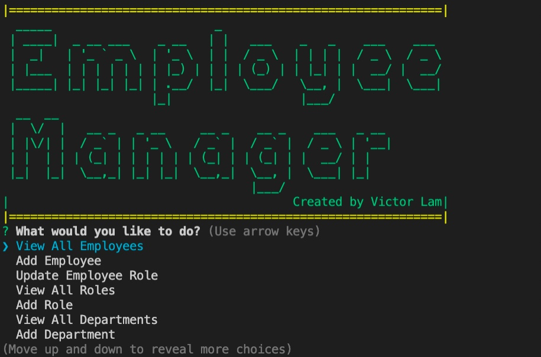
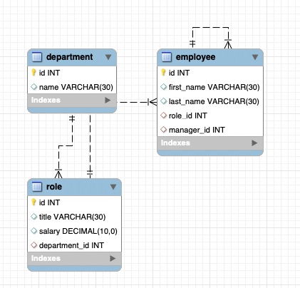

# # employee-tracker
## Description
Employee Tracker is a Node.js command-line application using inquirer, chalk, console.table, figlet and mysql to manage employee database. 

Repository: 
    https://github.com/mingmanhk/employee-tracker
     

## Table of Contents
1. [Installation](#installation)

2. [Usage](#usage)

3. [Credits](#credits)

4. [License](#license)

5. [Features](#features)

6. [Contribute](#contribute)

7. [Test](#test)

8. [Questions](#questions)

## Installation
    1. Run npm install to install all dependencies
    2. Run schema.sql in MySQLWorkbench to create database schema
    3. Run seeds.sql in MySQLWorkbench to add sample data

## Usage
   1. Open terminal
   2. Run 'npm start'
   3. Select option all questions
   
   
   
## Credits
Victor Lam

## License

## Features
This application provided following functionality:

    * View all employees
    * View all roles
    * View all departments
    * Add employee
    * Change employee role
    * Add role
    * Add department

## Contribute
Victor Lam

## Questions
Questions about this repository? Please contact me at [mingmanhk@gmail.com](mailto:mingmanhk@gmail.com).
View more of my work in GitHub at [mingmanhk](https://github.com/mingmanhk)